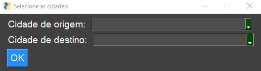
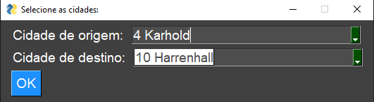
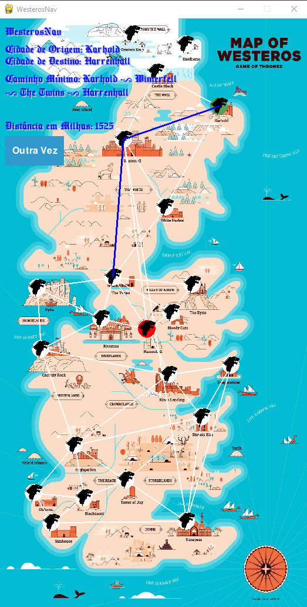
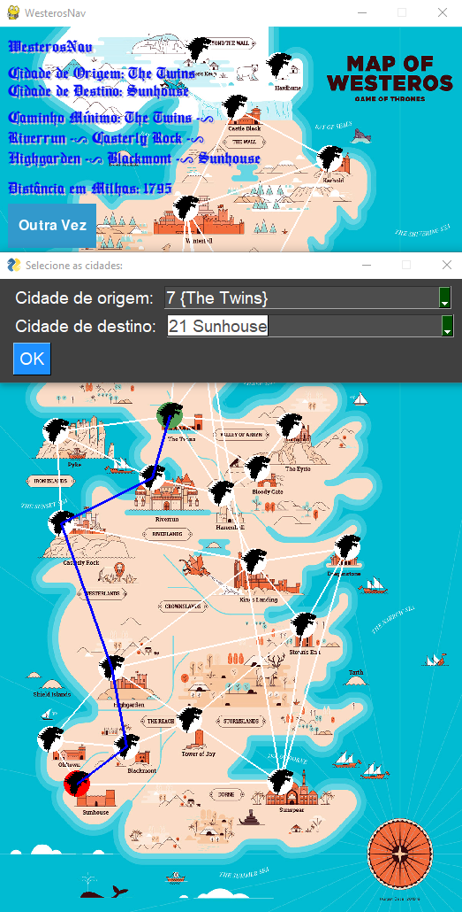

# Grafos2_WesterosNav

**Número da Lista**:25<br>
**Conteúdo da Disciplina**: Grafos2<br>

## Alunos
|Matrícula | Aluno |
| -- | -- |
| 20/0028472  |  Vinícius Assumpção de Araújo T01 |
| 20/0028367  |  Victor Hugo Oliveira Leão T02 |

## Sobre

O projeto desenvolvido trata-se de um navegador pelo mapa de [Westeros (Game of Thrones)](https://gameofthrones.fandom.com/pt-br/wiki/Westeros) em que o usuário consegue ver o caminho mínimo entre 22 das mais famosas cidades do continente e, o mais interessante, ver a distância em milhas entre essas cidades (quem é fã sempre quis saber o quanto os personagens andaram no mapa!).

A principal ligação com o conteúdo de Grafos 2 é, além da estrutura de Grafos para representar o mapa (as cidades são vértices e suas caminhos são as arestas), o algoritmo de Dijkstra, que calcula o menor caminho entre dois pontos e a sua distância. Sendo assim, os integrantes da dupla conseguiram revisar o conteúdo de Grafos, além de aplicar um algoritmo muito utilizado para diversas ocasiões.

O mapeamento, isto é, a operação de passar o mapa de Westeros para um grafo (distância entre os pontos), foi feito a partir das seguintes fontes: https://winteriscoming.net/2015/11/10/game-of-thrones-fan-tabulates-distances-between-places-in-westeros/ e https://www.worldanvil.com/w/got-rewritten/a/travel.

## Screenshots






## Vídeo

- [youtube](https://www.youtube.com/watch?v=-AC-JlozkYk)

 

https://github.com/projeto-de-algoritmos/Grafos2_WesterosNav/assets/78980842/9715a0cb-6a00-4e87-a457-4a03142db26c


## Instalação 
**Linguagem**: Python<br>
**Framework**: Pygame<br>

Para rodar o projeto, é necessário ter a linguagem Python instalada e instalar as dependências por meio do comando: ```pip install -r requirements.txt```.

Assim, para executar o programa, rode o comando: ```python main.py``` na pasta WesterosNav.

O programa foi desenvolvido e testado no sistema operacional Windows.

## Uso 

Após a execução do programa, será aberto duas abas e a música de ambiente começará a tocar.

O primeiro passo é selecionar 2 cidades inicias e clicar no botão "OK":


Assim, a outra aba será atualizada com o mapa, mostrando o menor caminho entre as cidades e a sua distância em milhas:


Se essa aba estiver desproporcional em seu computador, é possível alterar os parâmetros WIDTH e HEIGHT no arquivo [params.py](https://github.com/projeto-de-algoritmos/Grafos2_WesterosNav/blob/master/WesterosNav/utils/params.py).

Caso queira testar novamente o programa com outras cidades, só clicar no botão "Outra Vez" e repetir o primeiro passo de selecionar as cidades e clicar em "OK".

## Outros 

Mostre o programa em execução para seus amigos e conhecidos que gostam de Game of Thrones, aposto que eles gostarão!

Algumas melhorias podem ser feitas, sinta-se a vontade para fazê-las e nos avisar:

- Adicionar um mapa com mais cidades.
- Tentar ver as distâncias e caminhos com mais veracidade com mais fontes.
- Mudar o ícone da cidade para a bandeira da casa que a detém.
- Melhorar um pouco graficamente e tornar responsivo.
